# MYExpenses

## See preview here: https://myexpenses-service.herokuapp.com/
### Demo Credentials
- User:    demo
- Password:    myexpenses
---
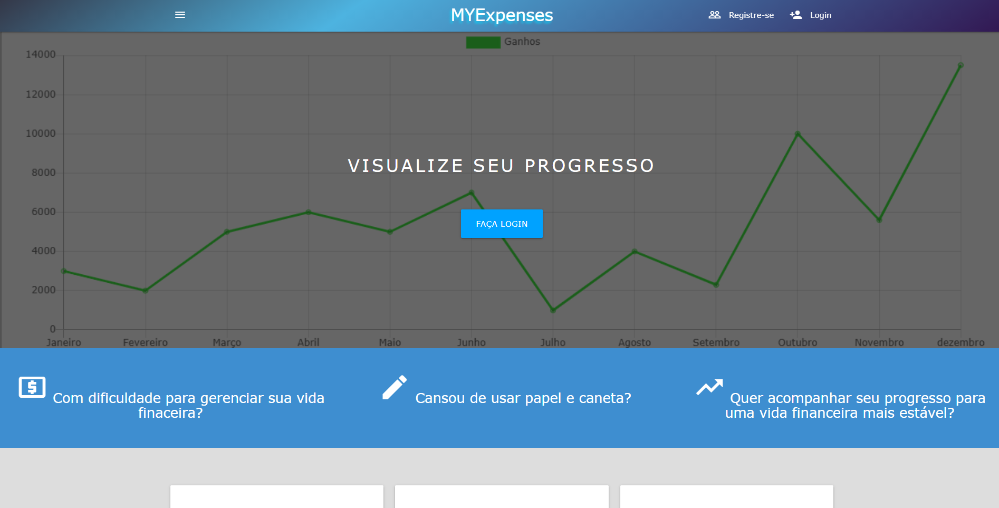

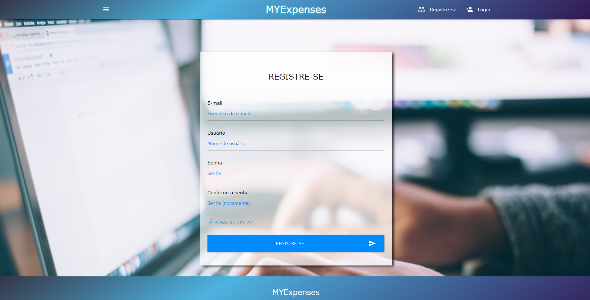

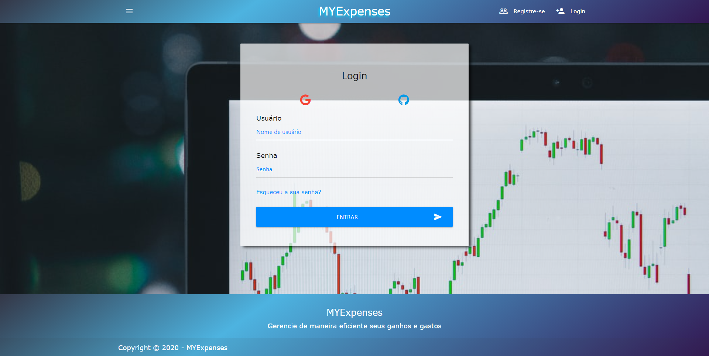

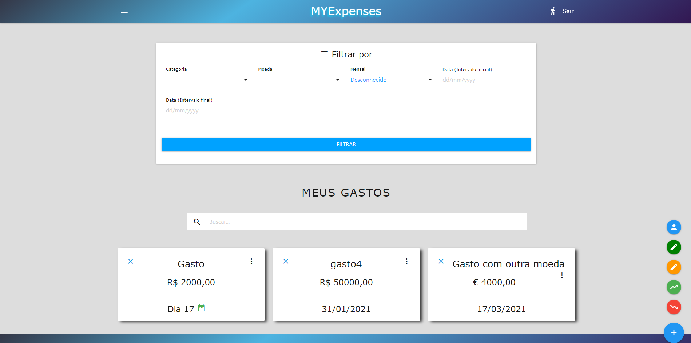

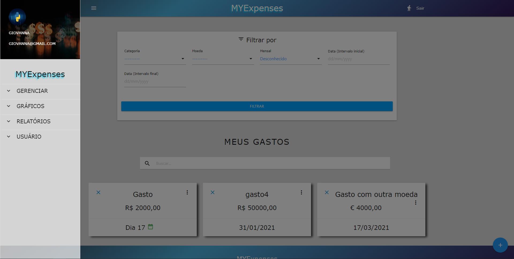

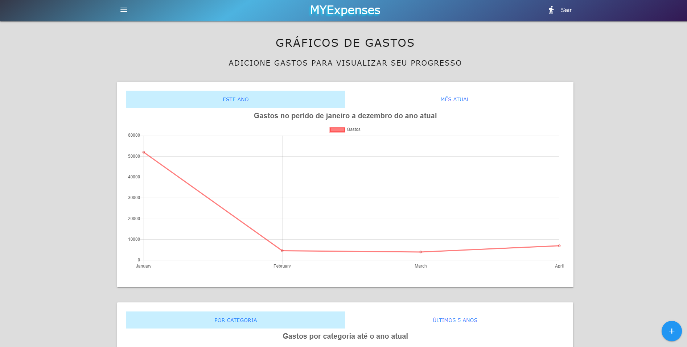

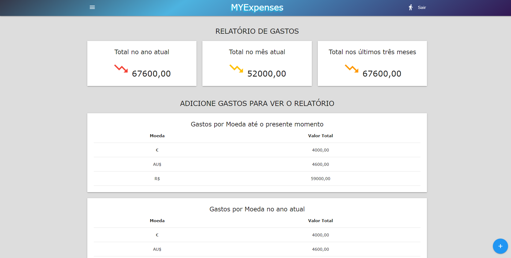

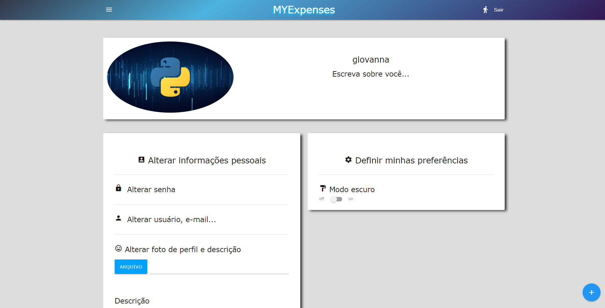

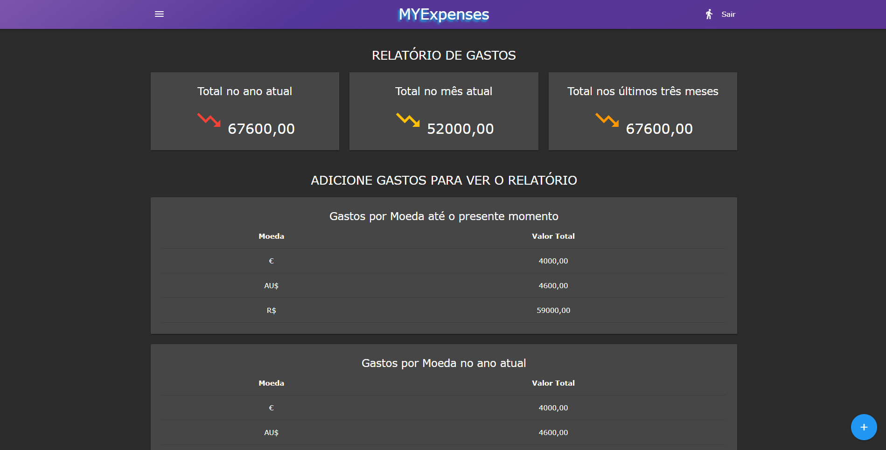

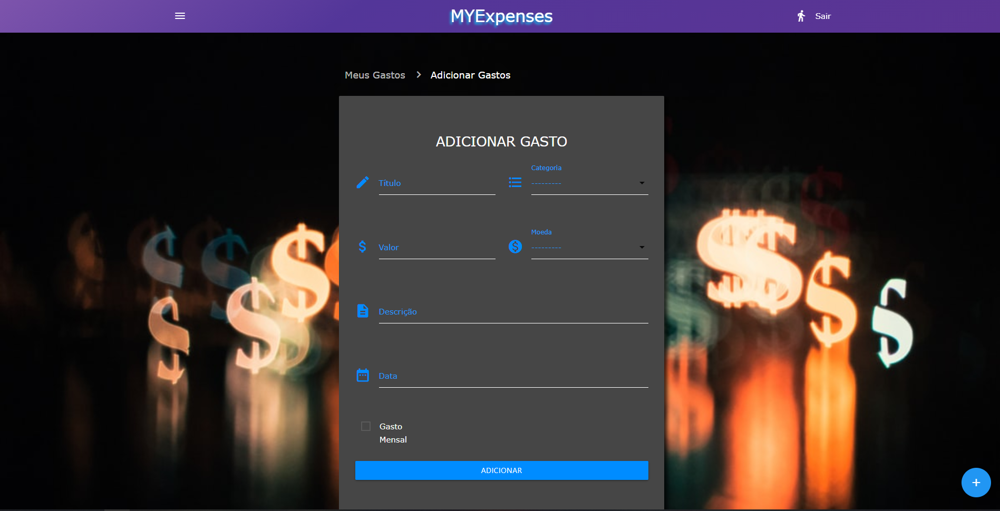

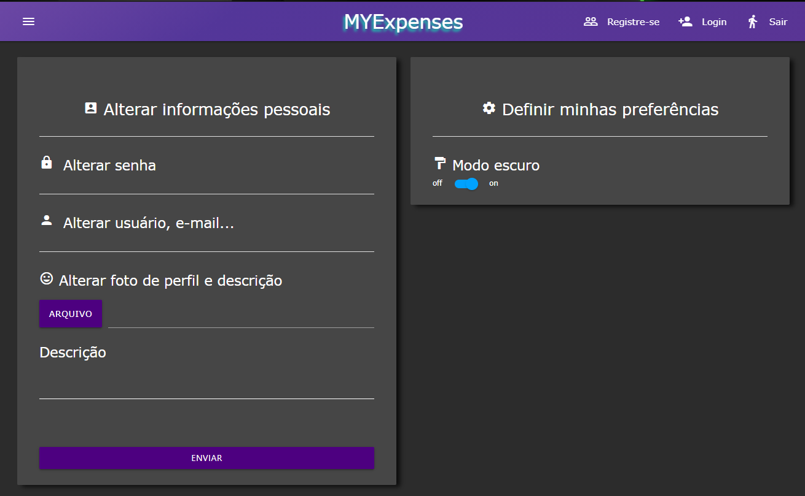

---

### Table of Contents
Find yourself here

- [Description](#description)
- [How To Use](#how-to-use)
- [License](#license)
- [Author Info](#author-info)
- [Features](#Features)

---

## Description
MYExpenses is a web app to manage earnings and expenses, view earnings and expenses data in dynamic graphs, generate reports and receive reminders about monthly expenses.

## Technologies

### Database
- PostgreSQL
- Redis
### Backend
- Python
- Django framework
- Celery (Task Queue)
- Celery Beat
- Crontab
### Frontend
- HTML5
- CSS3
- Materialize css
- SASS

---
## Features

### User Registration
- username
- email
- password
- confirm password
- email confirmation

### User Login
- It is possible to log in using username and password, Google or GitHub account

### Profile

- Change your profile photo and description
- Reset your password
- Update your data including username and email
- Darkmode option

### Forgot password
- You can recover your access typing your e-mail used when you register

### Currency
- Supports more than 100 currencies

### Earnings and Expenses
- You can add monthly or single earnings and expenses
- You can update and delete earnings and expenses
- It is possible to filter by category, interval date, currency or monthly earnings or expenses
- if you have a lot of earnings and expenses you can search by title, description or value

### Dashboards
- See your earnings and expenses on interactive charts dynamically including:
- Earnings and Expenses from January to December in the current year
- First to fourth week of the current month
- View the amount of your earnings and expenses by category
- See the amount in the last five years

### Reports
- View your earnings and expenses by currency including:
- Total in the current year, last three months, current month
- Earnings or Expenses per currency in the current year
- Earnings or Expenses per currency in the current month
- Earnings or Expenses per currency in the last three months
- Current Earanings or Expenses per currency

### Email Reminders
- When adding monthly expenses you receive emails on the 1st and 15th every month.

### Export PDF
- You can export your report data in pdf format

---

## How To Use

### Run locally
#### Use at least python 3.8.3 version
### Clone the project

```html
git clone https://github.com/GiovannaK/MYExpenses.git
```
### Create and start a virtual environment

#### Windows
```html
python -m venv venv

venv\Scripts\activate.bat

python -m pip install --upgrade pip setuptools wheel --user

pip install -r requirements.txt

python manage.py migrate
```

#### Linux

```html
python3 -m venv venv

. venv/bin/activate

pip install -r requirements.txt

python manage.py migrate
```

#### MAC

```html
python -m venv venv

. venv/bin/activate

pip install -r requirements.txt

python manage.py migrate
```

### Database

#### Create a postgres database and add the credentials to settings.py

```html
DATABASES = {
    'default': {
        'ENGINE': 'django.db.backends.postgresql_psycopg2',
        'NAME': 'db_name',
        'USER': 'name',
        'PASSWORD': '',
        'HOST': 'localhost',
        'PORT': '',
    }
}
```

### Celery and Redis
- This application uses celery and redis as storage and broker, include your redis credentials to start celery in settings.py. 

REDIS_URI is an environment variable, in case you want to add a service like heroku redis.

```html
CELERY_BROKER_URL = os.environ.get("REDIS_URI", "redis://redis:6379/0")

CELERY_RESULT_BACKEND = os.environ.get("REDIS_URI", "redis://redis:6379/0")
```

### Docker
- Assuming you already have the docker installed and properly configured run the following command build the image and start the container. This application has four containers including web for Django, Celery, Celery beat and redis.

```html
docker-compose up
```
### You may need these commands:

- Stop it all running

```html
docker-compose down
```

- In case you change something in docker-compose.yml

```html
docker-compose build
```

- In case you need to build only one container

```html
docker-compose build containername
```

### S3 bucket was used to store static files and images you can create an account in AWS, create a bucket and setup the credentials in settings.py

```html
AWS_ACCESS_KEY_ID = config('AWS_ACCESS_KEY_ID')
AWS_SECRET_ACCESS_KEY = config('AWS_SECRET_ACCESS_KEY')
AWS_STORAGE_BUCKET_NAME = config('AWS_STORAGE_BUCKET_NAME')
AWS_S3_FILE_OVERWRITE = False
AWS_DEFAULT_ACL = None
DEFAULT_FILE_STORAGE = 'storages.backends.s3boto3.S3Boto3Storage'
STATICFILES_STORAGE = 'storages.backends.s3boto3.S3Boto3Storage'

STATIC_URL = 'http://' + AWS_STORAGE_BUCKET_NAME + '.s3.amazonaws.com/'
ADMIN_MEDIA_PREFIX = STATIC_URL + 'admin/'
```
### If you don't want to use the S3 bucket, delete the credentials, remove ADMIN_MEDIA_PREFIX and change STATIC_URL to 

```html
STATIC_URL = '/static/'
```
### Generate a secret key and add to settings.py
---
### You can use this link to generate your secret key
#### https://miniwebtool.com/django-secret-key-generator/
---
### Run this command to migrate your database

```html
docker-compose exec web python manage.py migrate
```
### Run this to create an admin account

```html
docker-compose exec web python manage.py createsuperuser
```
### Start the development server in localhost:8000

```html
docker-compose exec web python manage.py runserver
```


---


## License

MIT License

Copyright (c) [2020]

Permission is hereby granted, free of charge, to any person obtaining a copy
of this software and associated documentation files (the "Software"), to deal
in the Software without restriction, including without limitation the rights
to use, copy, modify, merge, publish, distribute, sublicense, and/or sell
copies of the Software, and to permit persons to whom the Software is
furnished to do so, subject to the following conditions:

The above copyright notice and this permission notice shall be included in all
copies or substantial portions of the Software.

THE SOFTWARE IS PROVIDED "AS IS", WITHOUT WARRANTY OF ANY KIND, EXPRESS OR
IMPLIED, INCLUDING BUT NOT LIMITED TO THE WARRANTIES OF MERCHANTABILITY,
FITNESS FOR A PARTICULAR PURPOSE AND NONINFRINGEMENT. IN NO EVENT SHALL THE
AUTHORS OR COPYRIGHT HOLDERS BE LIABLE FOR ANY CLAIM, DAMAGES OR OTHER
LIABILITY, WHETHER IN AN ACTION OF CONTRACT, TORT OR OTHERWISE, ARISING FROM,
OUT OF OR IN CONNECTION WITH THE SOFTWARE OR THE USE OR OTHER DEALINGS IN THE
SOFTWARE.


---

## Author Info

- Linkedin - [Giovanna Cunha](https://www.linkedin.com/in/giovanna-cunha-4989b81b2/)


